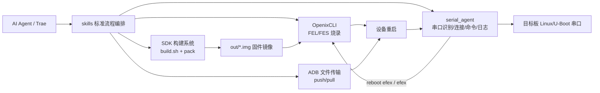
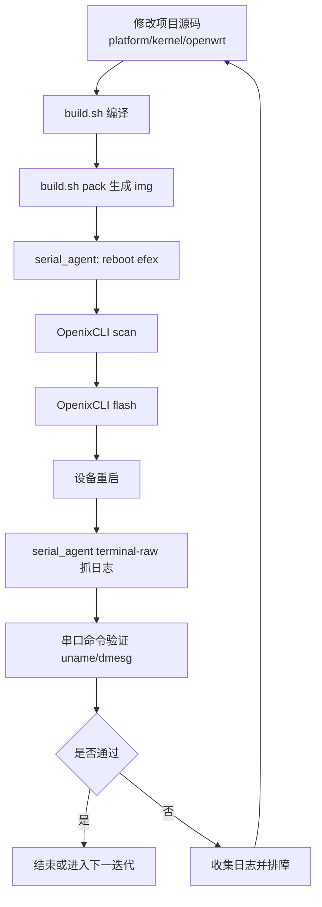

# 100ASK-T113S4SdNand PRO  AI 自动化开发框架


本仓库面向 T113S4 嵌入式开发，提供一套可被 AI Agent 直接调用的自动化工具链，覆盖：
- SDK 编译与镜像打包
- 串口自动识别、连接与日志采集
- 设备自动切换烧录模式（`reboot efex` / `efex`）
- OpenixCLI 自动烧录（FEL/FES、重连容错）
- 启动验证与问题回溯
- 基于 ADB 的文件自动传输

该框架的核心思路是：将底层工具能力（`tools/OpenixCLI`、`tools/serial_agent`）封装成可编排步骤，由 `skills/` 中的标准化流程驱动，形成端到端“编译 -> 烧录 -> 启动验证 -> 迭代”的闭环。

## 1. 系统概述

### 1.1 目标

- 为 AI Agent 提供可重复执行的嵌入式开发标准流程。
- 降低人工切换终端、找串口、处理 USB 抖动、抓日志的成本。
- 在“代码修改 -> 设备验证”之间建立稳定自动化链路。

### 1.2 仓库关键目录

```text
100ASK_T113s4-SdNand_TinaSDK5/
├── tools/
│   ├── OpenixCLI/             # Rust 烧录工具（当前仓库含可执行文件与文档）
│   └── serial_agent/          # Python 串口 Agent 工具集
├── skills/                    # AI 可调用的标准化流程编排
├── out/                       # 编译输出镜像（如 t113_s4_linux_100ask_uart0.img）
├── platform/ kernel/ openwrt/ # 项目源码（被编译并打包进镜像）
└── README.md
```

## 2. 整体架构设计

### 2.1 架构图



### 2.2 分层说明

- 编排层（`skills/`）：定义“先做什么、后做什么、失败如何恢复”。
- 工具层（`OpenixCLI`、`serial_agent`）：提供原子能力（烧录、串口、日志）。
- 源码层（`platform/`、`kernel/`、`openwrt/`）：实现业务功能并产出镜像。
- 设备层（T113S4 板卡）：执行烧录、启动、运行验证。

## 3. 核心组件与实现原理

## 3.1 OpenixCLI（固件烧录核心）

功能定位：
- 扫描 Allwinner 设备（`scan`）。
- 烧录固件镜像（`flash <firmware>`）。
- 管理 FEL -> FES 阶段切换与重连窗口。
- 支持校验、分区烧写、烧录后动作（重启/关机）。

核心命令：

```bash
./target/release/openixcli --help
./target/release/openixcli scan
./target/release/openixcli flash out/t113_s4_linux_100ask_uart0.img -v
```

关键参数（节选）：
- `--reconnect-timeout-sec`：FEL->FES 切换后的重连超时（默认 90）。
- `--reconnect-interval-ms`：重连轮询间隔（默认 500ms）。
- `--mode`：`partition/keep_data/partition_erase/full_erase`。
- `--post-action`：`reboot/poweroff/shutdown`。
- `--verify`：写入后校验。

实现原理（框架视角）：
- 先通过 USB 枚举确认设备处于烧录可用模式（FEL/FES）。
- 按固件内容和分区策略执行下载与写入。
- 在设备模式切换窗口内轮询重连，降低虚拟机 USB 抖动造成的失败率。

## 3.2 serial_agent（串口自动化核心）

模块组成：
- `serial_core.py`：串口配置、端口扫描、自动选口、读写会话。
- `trae_serial_terminal.py`：CLI 入口（`scan/io/terminal/terminal-raw`）。
- `serial_pexpect.py`：基于 `picocom + pexpect` 的交互场景处理。
- `langchain_tools.py` / `crewai_tools.py`：面向 Agent 的工具接口封装。

关键能力：
- 自动识别串口：支持按 `VID/PID/SN/product/description` 筛选。
- 自动连接：按优先级选择 `/dev/ttyACM*`、`/dev/ttyUSB*`。
- 命令执行：`io --send "<cmd>"` 进行一次性命令与回读。
- 长连接透传：`terminal-raw` 字符级转发，支持日志落盘。
- 退出保护：`Ctrl+]` 本地退出，不将退出符误发送到设备端。

实现原理（框架视角）：
- 通过 `pyserial` 获取端口元信息并建立会话。
- 使用“读到静默窗口”为止的策略（`read_until_quiet`）收敛命令输出。
- 在透传模式下直接进行字节收发，最大程度贴近原生串口终端行为。

## 3.3 skills（流程编排层）

`skills/` 将多工具串成可复用闭环，典型流程：
- `system-sdk-ai-default`：默认全流程（编译、打包、烧录、串口验证）。
- `t113s3-flash-serial-debug`：烧录与串口联调增强版。
- `t113-c906-heterogeneous-dev`：异构与 RPMsg 场景联调。
- `t113s4-lvgl-ui-demo-dev`：UI 开发与板端验证（含 ADB 文件传输）。

## 4. OpenixCLI 与 serial_agent 交互关系

两者不是互相调用的库关系，而是“由编排层协同驱动”的串并行关系：

1. `serial_agent` 在 Linux shell/U-Boot 下发送 `reboot efex` 或 `efex`。  
2. 设备切入 FEL/FES 烧录通道后，`OpenixCLI` 执行 `scan/flash`。  
3. 烧录结束自动重启后，`serial_agent` 再次接管串口，做启动日志与命令验证。  
4. 若需要快速迭代应用文件，由 ADB 进行文件推送并回到串口/系统验证。  

这条链路解决了嵌入式开发里最常见的“模式切换断点”问题：运行态 -> 烧录态 -> 运行态。

## 5. 自动化功能模块说明

### 5.1 串口调试自动识别与连接

命令示例：

```bash
cd tools/serial_agent
python3 trae_serial_terminal.py scan --json
python3 trae_serial_terminal.py io \
  --auto-select --vid 1a86 --pid 55d4 \
  --baudrate 115200 --send "uname -a"
```

机制要点：
- 先过滤再排序，避免误连无关串口。
- 指定过滤条件但未命中时直接报错，不盲目回退。

### 5.2 固件自动烧录流程

命令示例：

```bash
cd tools/OpenixCLI
./target/release/openixcli scan -l
./target/release/openixcli flash /home/ubuntu/T113-tina5v1.2-sdk/out/t113_s4_linux_100ask_uart0.img \
  --reconnect-timeout-sec 240 \
  --reconnect-interval-ms 300 \
  -v
```

机制要点：
- 识别设备模式并进入对应烧录路径。
- 使用可配置重连窗口应对 FEL/FES 过渡期掉线。

### 5.3 设备自动复位机制

典型命令：

```bash
cd tools/serial_agent
python3 trae_serial_terminal.py io \
  --auto-select --vid 1a86 --pid 55d4 \
  --baudrate 115200 --send "reboot efex"
```

机制要点：
- 运行态直接下发复位指令切换烧录通道。
- U-Boot 场景可手动发送 `efex` 进入烧录态。

### 5.4 文件自动传输协议

当前框架默认采用 **ADB 文件传输通道**（非串口 X/YMODEM）：

```bash
HOME=/tmp/adbhome adb push /tmp/lv_hello_t113s4 /tmp/lv_hello_t113s4
HOME=/tmp/adbhome adb shell 'chmod +x /tmp/lv_hello_t113s4'
HOME=/tmp/adbhome adb shell '/tmp/lv_hello_t113s4 > /tmp/lv_hello_run.log 2>&1 &'
```

机制要点：
- 适用于“应用快速验证”而非整镜像替换。
- 与 OpenixCLI（全量镜像烧录）形成互补：快传小文件 + 稳定刷整包。

## 6. 端到端流程图



## 7. 环境要求

主机环境（Linux）：
- Python 3.8+（`serial_agent`）。
- Rust 工具链 + `libusb`（`OpenixCLI` 编译/运行）。
- 串口权限（建议加入 `dialout`）。
- 可选：`picocom`（`serial_pexpect.py` 依赖）。
- 可选：ADB（文件传输与快速部署）。

硬件环境：
- T113S4/T113S3 开发板。
- 可用 USB 串口与烧录链路。

## 8. 安装与部署

### 8.1 serial_agent

```bash
cd tools/serial_agent
python3 -m venv .venv
source .venv/bin/activate
pip install -r requirements.txt
```

### 8.2 OpenixCLI

当前仓库已包含 `tools/OpenixCLI/target/release/openixcli` 可执行文件。  
若需重编译，可参考 `tools/OpenixCLI/.trae/skills/openixcli-install-build/SKILL.md` 的 Rust 编译步骤。

## 9. 功能特性总览

- 自动串口发现与过滤选口（VID/PID/SN）。
- 串口一次性命令与长连接透传（含双向日志）。
- 设备自动切换烧录模式（`reboot efex` / `efex`）。
- OpenixCLI 支持 FEL/FES、重连窗口与多烧录策略。
- ADB 快速文件下发，缩短应用级迭代周期。
- 通过 `skills` 形成可复用的 AI 自动化执行链。

## 10. 配置参数说明

### 10.1 serial_agent 参数

| 参数 | 说明 | 默认值 |
|---|---|---|
| `--port` | 串口设备路径，如 `/dev/ttyACM0` | 空 |
| `--auto-select` | 启用自动选口 | `false` |
| `--vid/--pid` | VID/PID 过滤 | 空 |
| `--serial-number` | SN 精确匹配 | 空 |
| `--product/--description` | 文本关键字过滤 | 空 |
| `--baudrate` | 波特率 | `115200` |
| `--bytesize` | 数据位 | `8` |
| `--parity` | 校验位 | `N` |
| `--stopbits` | 停止位 | `1` |
| `--xonxoff/rtscts/dsrdtr` | 流控参数 | `false` |
| `--log-file` | 透传日志路径 | 空 |

### 10.2 OpenixCLI 参数

| 参数 | 说明 | 默认值 |
|---|---|---|
| `--bus`/`--port` | 指定 USB 总线与端口 | 自动 |
| `--verify` | 烧录后校验 | 启用 |
| `--mode` | 烧录模式 | `full_erase` |
| `--partitions` | 指定分区列表 | 空 |
| `--post-action` | 烧录后动作 | `reboot` |
| `--reconnect-timeout-sec` | 重连总超时 | `90` |
| `--reconnect-interval-ms` | 重连轮询间隔 | `500` |
| `-v` | 详细日志 | 关闭 |

## 11. API 接口参考

### 11.1 serial_core Python API

- `list_serial_ports_detail()`：获取端口详情。
- `auto_select_serial_port(...)`：按条件自动选口。
- `make_serial_config(...)`：构建串口配置。
- `SerialSession.open()/close()`：连接管理。
- `SerialSession.run_command(cmd)`：发送命令并读取输出。
- `SerialSession.read_available_text()`：读取当前缓存输出。

### 11.2 AI Agent 工具 API

LangChain（`langchain_tools.py`）与 CrewAI（`crewai_tools.py`）统一提供：
- `list_serial_ports`
- `open_serial`
- `send_serial_command`
- `read_serial_output`
- `close_serial`

### 11.3 CLI API

`serial_agent`：

```bash
python3 trae_serial_terminal.py scan [--json]
python3 trae_serial_terminal.py io ...
python3 trae_serial_terminal.py terminal ...
python3 trae_serial_terminal.py terminal-raw ...
```

`OpenixCLI`：

```bash
openixcli scan
openixcli flash <firmware> [options]
openixcli tui
```

## 12. 使用示例

### 示例 A：标准烧录闭环

```bash
# 1) 编译并打包
./build.sh
./build.sh pack

# 2) 串口命令切换烧录模式
cd tools/serial_agent
python3 trae_serial_terminal.py io --auto-select --vid 1a86 --pid 55d4 --baudrate 115200 --send "reboot efex"

# 3) 执行烧录
cd ../OpenixCLI
./target/release/openixcli flash /home/ubuntu/T113-tina5v1.2-sdk/out/t113_s4_linux_100ask_uart0.img \
  --reconnect-timeout-sec 240 --reconnect-interval-ms 300 -v

# 4) 启动验证
cd ../serial_agent
python3 trae_serial_terminal.py io --auto-select --vid 1a86 --pid 55d4 --baudrate 115200 --send "uname -a"
```

### 示例 B：应用快速传输验证（ADB）

```bash
HOME=/tmp/adbhome adb push /tmp/app.bin /tmp/app.bin
HOME=/tmp/adbhome adb shell 'chmod +x /tmp/app.bin && /tmp/app.bin'
```

## 13. 故障排查

### 13.1 `openixcli scan` 找不到设备

- 先确认设备是否已进入 FEL/FES（可先执行 `reboot efex`）。
- 检查 USB 枚举与权限：`lsusb`、`dmesg`。

### 13.2 `Device reconnect failed`

- 增大 `--reconnect-timeout-sec`（如 240）。
- 缩短 `--reconnect-interval-ms`（如 300）。
- 排查虚拟机 USB 透传抖动。

### 13.3 串口连接失败或连接错误设备

- 使用 `scan --json` 确认 VID/PID/SN。
- 显式指定 `--vid --pid`，避免自动连到无关设备。

### 13.4 U-Boot 卡在 `=>`

- 手动输入 `efex`，再执行 `openixcli flash`。

### 13.5 文件传输失败（ADB）

- `adb devices` 确认设备在线。
- 必要时执行 `adb wait-for-device` 后再 `push`。

## 14. 与项目源码协同关系

- 源码修改发生在 `platform/`、`kernel/`、`openwrt/` 等目录。
- `build.sh` 将源码编译并产出 `out/*.img`。
- `OpenixCLI` 负责把镜像写入目标板。
- `serial_agent` 负责模式切换、日志采集、启动验证。
- ADB 负责非整包场景下的小文件快速部署验证。

这使得“源码 -> 镜像 -> 烧录 -> 运行验证”全链路可由 AI 自动执行并复用。

## 15. 补充说明

- `tools/OpenixCLI` 在本仓库中主要提供二进制与文档；其源码结构可从 `target/release/*.d` 依赖信息和上游项目文档获得。
- 本 README 已保留仓库现有图片资源引用：`img/100ask-t113s4sdnand-pro.png`。
