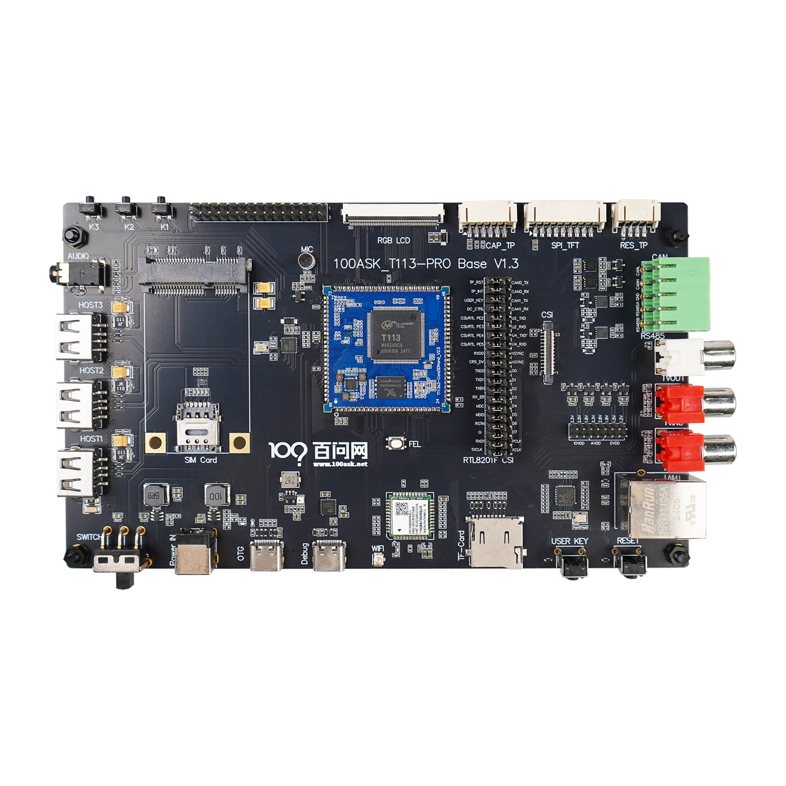
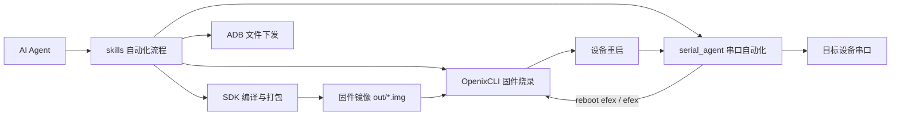
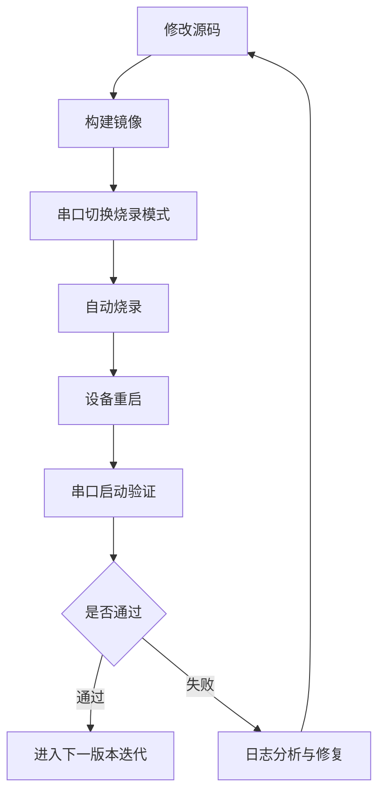

# T113S4 AI 自动化开发框架（对外发布版）



一套面向嵌入式开发团队的 AI 自动化工程框架，帮助开发者把“编译、烧录、串口调试、日志回归、文件下发”从人工串行操作升级为标准化、可复用、可扩展的自动化闭环。

## 产品简介

T113S4 AI 自动化开发框架聚焦嵌入式研发最耗时、最容易出错的环节：
- 串口识别与连接不稳定
- 烧录步骤繁琐且对环境敏感
- 设备模式切换（运行态/烧录态）断点多
- 调试日志难沉淀、问题难复现
- 版本回归效率低

框架通过 `OpenixCLI + serial_agent + 技能编排（skills）` 的组合，实现端到端自动化，显著降低 bring-up 与迭代验证成本。

## 核心价值

- 提效：减少人工切终端、手动选口、重复输入指令。
- 稳定：内置 FEL/FES 重连容错与串口自动匹配机制。
- 可复用：将验证流程沉淀为标准技能，团队共享同一套 SOP。
- 可追溯：串口收发日志、烧录日志可留档复盘。
- 可扩展：支持接入 LangChain/CrewAI 工具调用与定制流程。

## 适用场景

- 新板 bring-up 与首次系统启动验证
- 固件频繁迭代阶段的高频烧录回归
- 异构场景（A7 + C906）联调诊断
- UI/应用快速验证（ADB 文件快速下发）
- 团队标准化开发流程建设

## 产品架构



## 功能矩阵

| 功能模块 | 能力说明 | 典型收益 |
|---|---|---|
| 串口自动识别 | 按 VID/PID/SN 自动选口并连接 | 降低误连、错连风险 |
| 串口调试终端 | 一次性命令 + 长连接透传 + 双向日志 | 提升问题定位效率 |
| 自动复位切换 | 运行态下发 `reboot efex` 进入烧录态 | 缩短模式切换时间 |
| 自动烧录 | OpenixCLI 执行 FEL/FES 烧录与重连容错 | 提高烧录成功率 |
| 启动回归 | 串口自动采集启动日志并执行健康检查命令 | 缩短回归闭环 |
| 文件自动传输 | ADB 推送可执行文件进行快速验证 | 降低全量烧录频次 |

## 关键流程



## 快速体验（3 步）

### 1) 串口发现与连接

```bash
cd tools/serial_agent
python3 trae_serial_terminal.py scan --json
```

### 2) 设备切换烧录模式

```bash
python3 trae_serial_terminal.py io \
  --auto-select --vid 1a86 --pid 55d4 \
  --baudrate 115200 \
  --send "reboot efex"
```

### 3) 执行固件烧录

```bash
cd ../OpenixCLI
./target/release/openixcli flash /home/ubuntu/T113-tina5v1.2-sdk/out/t113_s4_linux_100ask_uart0.img \
  --reconnect-timeout-sec 240 \
  --reconnect-interval-ms 300 \
  -v
```

## 组件说明

### OpenixCLI（烧录引擎）

- 提供 `scan / flash / tui` 核心命令。
- 支持 FEL/FES 模式、写入校验、分区烧写。
- 内置重连参数，适配复杂 USB 环境。

### serial_agent（串口引擎）

- 提供 `scan / io / terminal / terminal-raw`。
- 支持自动选口、字符级透传、日志落盘。
- 支持与 LangChain/CrewAI 对接，供 AI Agent 调用。

### skills（流程引擎）

- 将工具能力组合为可复用标准流程。
- 覆盖默认 SDK 闭环、烧录排障、异构联调、UI 验证等场景。

## 兼容与环境要求

- 操作系统：Linux（推荐 Ubuntu/Debian）
- Python：3.8+
- Rust：用于 OpenixCLI 构建（仓库当前已包含可执行文件）
- 常见依赖：`pyserial`、`pexpect`、`libusb`
- 可选依赖：`adb`（用于应用快速下发）

## 典型交付成果

- 标准化自动化开发流程文档（团队可直接复用）
- 固件烧录与串口验证闭环能力
- 可追溯的调试日志资产
- 缩短从代码变更到板端验证的整体周期

## 商业化落地建议

- 先以“烧录+串口回归”作为首个自动化切入点。
- 再扩展到“应用快速分发（ADB）+专项场景技能”。
- 通过统一技能模板沉淀组织级研发 SOP。

## 了解更多

- 技术实现详情请参考 [README.md](README.md)
- 串口模块文档请参考 [tools/serial_agent/README.md](tools/serial_agent/README.md)
- 烧录模块文档请参考 [tools/OpenixCLI/README.md](tools/OpenixCLI/README.md)
